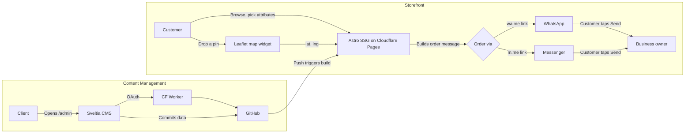

# Metal Hub

Trilingual (English / Nepali / Newari) product showcase and ordering site for handcrafted copper, brass, and bronze kitchenware from Kathmandu, Nepal.

## Tech Stack

| Layer | Choice |
|-------|--------|
| Framework | [Astro v7](https://astro.build) (SSG, zero JS by default) |
| Hosting | [Cloudflare Pages](https://pages.cloudflare.com) (free tier, unlimited bandwidth) |
| CMS | [Sveltia CMS](https://sveltia cms.dev) (git-backed, `/admin` route, no code needed) |
| CMS Auth | [sveltia-cms-auth](https://github.com/sveltia/sveltia-cms-auth) Cloudflare Worker |
| Map | [Leaflet.js](https://leafletjs.com) + OpenStreetMap tiles (free, no API key) |
| Ordering | WhatsApp (`wa.me`) + Messenger (`m.me`) deep links — no backend |
| Languages | English (default), Nepali (`/ne/`), Newari/Nepal Bhasa (`/newa/`) |

## Architecture



No server in the ordering path. The customer's own messaging app is the backend.

## Prerequisites

- **Node.js** >= 22.12.0
- **npm**
- **GitHub account** (for CMS auth and hosting)
- **Cloudflare account** (free tier is sufficient)

## Local Development

```sh
# Install dependencies
npm install

# Start dev server (http://localhost:4321)
npm run dev

# Build for production
npm run build

# Preview the production build
npm run preview
```

## Project Structure

```text
/
├── public/
│   ├── _headers                    # Cloudflare Pages caching rules
│   ├── _redirects                  # /admin → /admin/index.html
│   ├── admin/
│   │   ├── index.html              # Sveltia CMS loader
│   │   └── config.yml              # CMS collections, i18n, backend config
│   ├── favicon.ico
│   └── favicon.svg
│
└── src/
    ├── content.config.ts           # Astro content collection schemas (Zod)
    ├── content/
    │   ├── categories/             # Category markdown files (managed via CMS)
    │   ├── products/               # Product markdown files (managed via CMS)
    │   ├── settings/
    │   │   └── site.json           # WhatsApp number + Messenger page username
    │   └── social-highlights/      # Instagram/TikTok embed entries
    │
    ├── components/
    │   ├── AttributeSelector.astro # Product attribute picker + live pricing + add-to-cart
    │   ├── CartWidget.astro        # Cart display with qty controls
    │   ├── Footer.astro            # Site footer
    │   ├── Header.astro            # Sticky nav: links, cart badge, language toggle
    │   ├── MapPicker.astro         # Leaflet map for delivery pin placement
    │   ├── OrderButtons.astro      # WhatsApp + Messenger order message builder
    │   └── ProductCard.astro       # Product card with discount display
    │
    ├── i18n/
    │   ├── en.json                 # English UI dictionary
    │   ├── ne.json                 # Nepali UI dictionary
    │   └── newa.json               # Newari UI dictionary (displayed in Ranjana script)
    │
    ├── layouts/
    │   └── BaseLayout.astro        # HTML shell, OG tags, Header + Footer
    │
    ├── lib/
    │   ├── cart.ts                 # Client-side cart CRUD (localStorage)
    │   ├── i18n.ts                 # Translation loader + locale URL helpers
    │   └── pricing.ts              # Price calculation with discount precedence
    │
    ├── pages/
    │   ├── index.astro             # / — Home (hero, featured, categories)
    │   ├── checkout.astro          # /checkout — Cart, form, map, order buttons
    │   ├── social.astro            # /social — Facebook, Instagram, TikTok embeds
    │   └── products/
    │       ├── index.astro         # /products — Filterable product grid
    │       └── [slug].astro        # /products/:slug — Product detail
    │   ├── ne/                     # Nepali locale (same pages, /ne/ prefix)
    │   └── newa/                   # Newari locale (same pages, /newa/ prefix)
    │
    └── styles/
        └── global.css              # All styles (design tokens, components, responsive)
```

## Key Features

- **Trilingual i18n** — English (default), Nepali, and Newari displayed in Ranjana script via a self-hosted Devanagari-mapped font
- **Discount engine** — Product-level and per-attribute-option discounts with automatic best-price selection (no stacking)
- **Client-side cart** — `localStorage`-based, persists across pages, supports quantity adjustments
- **WhatsApp/Messenger ordering** — Pre-filled order message with items, pricing, and Google Maps delivery link; sent directly from the customer's app
- **Leaflet map** — Lazy-loaded delivery pin picker centered on Kathmandu Valley
- **Social media page** — Facebook Page Plugin (live feed) + curated Instagram/TikTok embeds via CMS
- **Sveltia CMS** — Client manages products, categories, social highlights, and translations at `/admin` — no git/code knowledge required

## Content Management

The client manages all content through the CMS at `/admin`:

1. **Products** — name & description (3 languages), category, images, base price, stock status, attributes with price modifiers, discounts
2. **Categories** — name (3 languages), icon emoji, display order
3. **Social Highlights** — Instagram/TikTok embed codes for the social page
4. **Site Settings** — WhatsApp number, Messenger page username

Saving in the CMS creates a git commit, which triggers an automatic Cloudflare Pages rebuild (~1-2 min).

## Deployment

See [deploy.md](deploy.md) for the full step-by-step deployment guide.

## Commands

| Command | Action |
|---------|--------|
| `npm install` | Install dependencies |
| `npm run dev` | Start dev server at `localhost:4321` |
| `npm run build` | Build production site to `./dist/` |
| `npm run preview` | Preview production build locally |
| `npm run astro check` | Run Astro type checking |

## License

Private — Metal Hub / Chandan.
