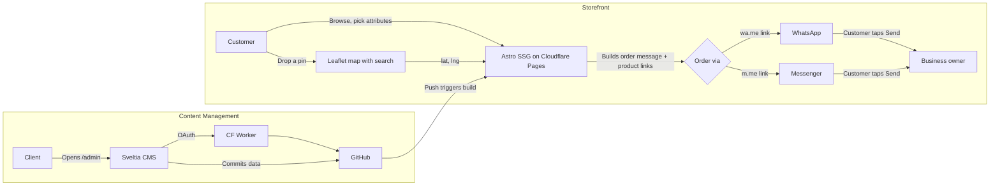

# Metal Hub

Trilingual (English / Nepali / Newari) product showcase and ordering site for handcrafted copper, brass, and bronze kitchenware from Kathmandu, Nepal.

## Tech Stack

| Layer | Choice |
|-------|--------|
| Framework | [Astro v7](https://astro.build) (SSG, zero JS by default) |
| Styling | [Tailwind CSS v4](https://tailwindcss.com) (CSS-first config via `@tailwindcss/vite`) |
| Linting | [Biome](https://biomejs.dev) (formatter + linter, 4-space indent, double quotes) |
| Hosting | [Cloudflare Pages](https://pages.cloudflare.com) (free tier, unlimited bandwidth) |
| CMS | [Sveltia CMS](https://sveltia cms.dev) (git-backed, `/admin` route, no code needed) |
| CMS Auth | [sveltia-cms-auth](https://github.com/sveltia/sveltia-cms-auth) Cloudflare Worker |
| Map | [Leaflet.js](https://leafletjs.com) + OpenStreetMap tiles + geocoder search (free, no API key) |
| Ordering | WhatsApp (`wa.me`) + Messenger (`m.me`) deep links — no backend |
| Languages | English (default), Nepali (`/ne/`), Newari/Nepal Bhasa (`/newa/`) |
| Package Mgr | [Bun](https://bun.sh) |

## Architecture



No server in the ordering path. The customer's own messaging app is the backend.

## Prerequisites

- **[Bun](https://bun.sh)** >= 1.0
- **GitHub account** (for CMS auth and hosting)
- **Cloudflare account** (free tier is sufficient)

## Local Development

```sh
# Install dependencies
bun install

# Start dev server (http://localhost:4321)
bun run dev

# Lint and format
bun run lint:fix

# Build for production
bun run build

# Preview the production build
bun run preview

# Type check
bun run astro check
```

## Project Structure

```text
/
├── public/
│   ├── _headers                    # Cloudflare Pages caching rules
│   ├── _redirects                  # /admin → /admin/index.html
│   ├── admin/
│   │   ├── index.html              # Sveltia CMS loader
│   │   └── config.yml              # CMS collections, i18n, backend config
│   ├── favicon.ico
│   └── favicon.svg
│
└── src/
    ├── content.config.ts           # Astro content collection schemas (Zod)
    ├── content/
    │   ├── categories/             # Category markdown files (managed via CMS)
    │   ├── products/               # Product markdown files (managed via CMS)
    │   └── i18n/                   # CMS-managed translation markdown files
    │   └── settings/
    │       └── site.json           # WhatsApp number + Messenger page username
    │
    ├── components/
    │   ├── AttributeSelector.astro # Product attribute picker + live pricing + add-to-cart + URL params
    │   ├── CartWidget.astro        # Cart display with images, qty controls, product links
    │   ├── Footer.astro            # Site footer
    │   ├── Header.astro            # Sticky nav with active links, cart dropdown, language selector
    │   ├── MapPicker.astro         # Leaflet map with geocoder search for delivery pin
    │   ├── OrderButtons.astro      # WhatsApp + Messenger order message builder with product links
    │   └── ProductCard.astro       # Product card with discount display
    │
    │
    ├── layouts/
    │   └── BaseLayout.astro        # HTML shell, OG tags, ClientRouter, Header + Footer
    │
    ├── lib/
    │   ├── i18n.ts                 # Translation loader + locale URL helpers
    │   └── pricing.ts              # Price calculation with discount precedence
    │
    ├── pages/
    │   └── [...locale]/            # Dynamic routes for all 3 locales
    │       ├── index.astro         # Home (hero, featured, categories, pagination)
    │       ├── checkout.astro      # Cart, form, map, order buttons
    │       ├── social.astro        # Facebook, Instagram, TikTok embeds
    │       └── products/
    │           ├── index.astro     # Filterable product grid with "Load More"
    │           └── [slug].astro    # Product detail: gallery, lightbox, share, social embeds
    │
    └── styles/
        └── global.css              # Tailwind config + residual CSS (view transitions, Leaflet)
```

## Key Features

- **Trilingual i18n** — English (default), Nepali, and Newari displayed in Ranjana script via a self-hosted Devanagari-mapped font
- **Discount engine** — Product-level and per-attribute-option discounts with automatic best-price selection (no stacking)
- **Per-option images** — Attribute options can have multiple images; selecting an option swaps the gallery
- **Product gallery** — Thumbnail strip with prev/next arrows, fullscreen lightbox with keyboard navigation
- **Share button** — Share popup with WhatsApp, Facebook, Twitter, and copy-to-clipboard; URL includes attribute params for shareable links
- **Client-side cart** — `localStorage`-based with quantity selector, product images, and clickable product links in cart dropdown and checkout
- **WhatsApp/Messenger ordering** — Pre-filled order message with items, pricing, product links, and Google Maps delivery link
- **Map with search** — Leaflet map with geocoder search for finding delivery locations by landmark name
- **Social media embeds** — Facebook Page Plugin, TikTok profile embed, Instagram profile embed (lazy-loaded)
- **Active nav highlighting** — Current page highlighted in navigation bar
- **Product pagination** — "Load More" button on products listing page
- **Sveltia CMS** — Client manages products, categories, translations, and social embeds at `/admin`

## Content Management

The client manages all content through the CMS at `/admin`:

1. **Products** — name & description (3 languages), category, images, base price, stock status, featured toggle, translatable attributes with per-option discounts and images, per-product social media embeds
2. **Categories** — name (3 languages), icon emoji, display order
3. **Site Settings** — WhatsApp number, Messenger page username
4. **Translations** — UI string overrides per locale

Attribute names and option labels are fully translatable (stored as `{en, ne, newa}` objects). Each attribute option can have multiple images and independent discounts.

Saving in the CMS creates a git commit, which triggers an automatic Cloudflare Pages rebuild (~1-2 min).

## Deployment

See [deploy.md](deploy.md) for the full step-by-step deployment guide.

## Commands

| Command | Action |
|---------|--------|
| `bun install` | Install dependencies |
| `bun run dev` | Start dev server at `localhost:4321` |
| `bun run lint` | Check for lint/format issues |
| `bun run lint:fix` | Auto-fix lint and format issues |
| `bun run format` | Format all files |
| `bun run build` | Build production site to `./dist/` |
| `bun run preview` | Preview production build locally |
| `bun run astro check` | Run Astro type checking |

## License

Private — Metal Hub / Chandan.
