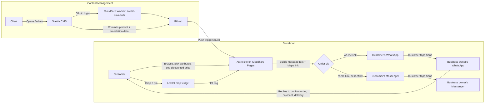

# Software Requirements Specification
## Metal Hub — Product Showcase & Ordering Site

| | |
|---|---|
| **Version** | 1.3 |
| **Date** | 2026-06-23 |
| **Stack** | Astro (SSG) + Cloudflare Pages + Sveltia CMS + Leaflet/OSM |
| **Author** | Chandan |

---

## 1. Overview

A static, mobile-first, trilingual storefront for Metal Hub (copper/brass/bronze kitchenware, Kathmandu) that:

- Showcases the product catalog with variant properties (size, material, finish) and discounts at both the product and individual attribute-option level
- Toggles between English, Nepali, and Newari/Nepal Bhasa — the third displayed in Ranjana script (रञ्जना लिपि)
- Lets customers pick a delivery drop point on a map, then place the order as a pre-filled WhatsApp/Messenger message straight to the business — no payment gateway, no backend required for the order itself
- Gives the **client** (non-technical, no git/code knowledge) a simple web UI to add, edit, and remove products themselves
- Costs **$0/month** at current traffic levels and stays fast globally

## 2. Assumptions & Out of Scope (v1)

- **No embedded payment gateway, and the site never asks for a payment method.** That's left entirely to the WhatsApp/Messenger conversation the order kicks off — the business owner tells the customer where to pay (COD, bank QR, eSewa, whatever fits that order), same as how the business already operates.
- **Order record = the WhatsApp/Messenger thread itself.** No order dashboard in v1. The business owner replies directly to the customer in that thread to confirm, adjust, and arrange delivery.
- **No customer accounts/login.** Guest ordering only.
- **No live stock sync** — "in stock / out of stock" is a manual toggle the client sets, not deducted automatically per order.
- **Three languages, single currency (NPR).** English (default) and Nepali are straightforward — both are properly Unicode-encoded (Latin, Devanagari). Newari/Nepal Bhasa in Ranjana script is a different situation, flagged clearly because it changes the implementation: **Ranjana has no official Unicode encoding yet** (a proposal has existed since 2009 and is still pending Unicode Consortium approval as of late 2025). In practice, *every* real Ranjana website today works around this by storing the text as ordinary Devanagari and displaying it through a Devanagari-mapped Ranjana font — see §5.1 for exactly how this is implemented here. It's the standard, not a shortcut.
- **Map drop-point capture is a pin location, not a full address-autocomplete system** — kept deliberately simple and free; reverse-geocoded place names are a nice-to-have, not a requirement.

## 3. Why this stack

| Requirement | Choice | Reasoning |
|---|---|---|
| Free + fast hosting | **Cloudflare Pages** | Unlimited bandwidth even on free tier, 500 builds/month, global edge network, no card required. |
| Static frontend | **Astro** | Ships zero JS by default; cart, map widget, and language toggle are the only interactive bits. |
| Client product management | **Sveltia CMS** | Git-backed headless CMS, <500KB, modern successor to Decap/Netlify CMS. Web form at `/admin`, no code/git needed, works on mobile, has first-class **i18n support** for translating specific fields per locale. |
| Auth for the CMS | **Cloudflare Worker (`sveltia-cms-auth`)** | One-click-deploy OAuth proxy, free, stays inside Cloudflare. |
| Trilingual routing | **Astro's built-in i18n** | `en` (default, root), `ne` (`/ne/...`), `newa` (`/newa/...`) — no extra package needed. |
| Newari / Ranjana display | **Devanagari text + self-hosted "Ranjana Lipi" web font** | Since Ranjana isn't Unicode-encoded, the workaround everyone uses is: store real Devanagari text (the client types it normally, no special script-input skill needed), then swap in a Ranjana-mapped font for that locale only. Falls back to plain, legible Devanagari if the font fails to load — never broken boxes. |
| Map / drop point | **Leaflet.js + OpenStreetMap tiles** | Fully free, no API key, no billing account — unlike Google Maps JS API. A dropped pin's lat/lng becomes a plain `google.com/maps?q=lat,lng` link in the order message, which opens fine in Google Maps on the recipient's phone without *you* needing any Maps API key. |
| Order delivery | **wa.me / m.me deep link, built client-side** | Zero backend. The customer's own WhatsApp/Messenger app sends the message; the business owner replies in the same thread to confirm — exactly the flow you described. |
| Social media page | **Official native widgets**: Facebook's Page Plugin (auto-updating feed) + Instagram/TikTok per-post embeds (curated) | All free, no paid third-party feed service (Smash Balloon, EmbedSocial, etc.), no API tokens needed for any of the three. Meta hosts the Page Plugin itself; Instagram/TikTok embeds use each post's own official "Embed" snippet. |

Dropped from v1: a custom backend (Pages Function + n8n + Telegram) for order intake. It's not needed since WhatsApp/Messenger *is* the notification channel and the confirmation channel at once. Kept as an **optional** Phase 3 add-on below if you later want a parallel record (Sheet/Postgres) beyond chat history.

## 4. Architecture



No server in the ordering path at all — the "backend" is the customer's own messaging app.

## 5. Functional Requirements

### 5.1 Storefront & i18n (EN / NE / Newari)
- **FR-1.1** Home page: hero, featured products, category shortcuts
- **FR-1.2** Product listing, filterable by category and stock status
- **FR-1.3** Product detail page: gallery, description, attribute selectors with live price recalculation
- **FR-1.4** Three-way language toggle (English / नेपाली / नेवाः) in the header, preserves the current page when switching
- **FR-1.5** All static UI text (buttons, labels, checkout form) sourced from `en.json` / `ne.json` / `newa.json` dictionaries
- **FR-1.6** Product `name` and `description` are translatable per-product via the CMS (§8); price, images, attributes, and discount are shared across all three languages
- **FR-1.7** **Newari content is typed in plain Devanagari** in the CMS's third language tab — the client (or translator) writes Nepal Bhasa wording the same way they'd type Nepali, no Ranjana glyph input required
- **FR-1.8** When the Newari locale is active, the site loads a self-hosted Ranjana-mapped web font and applies it via `font-family` to that locale's text; the stack falls back to a standard Devanagari font (e.g. Noto Sans Devanagari) if the Ranjana font fails to load, so the page degrades to readable text, never broken glyphs
- **FR-1.9** **Important:** Nepali and Nepal Bhasa are different languages, not the same text in a different script — the `ne` and `newa` fields need genuine, separately-written Nepal Bhasa wording, not a copy of the Nepali text. Worth confirming who's doing that translation before launch.
- **FR-1.10** Before shipping, verify the chosen Ranjana font's license permits embedding on a commercial site — most freely-downloadable community fonts (often credited to Nepal Lipi Guthi) are shared for personal/cultural use without an explicit commercial-redistribution license; a quick message to the credited author/source settles this

### 5.2 Discounts
- **FR-2.1** A product may have a **product-level discount**: `active` toggle, `type` (`percentage` or `flat`), `value`
- **FR-2.2** Any **attribute option** (any user-defined attribute, not just Size — e.g. a specific size, a specific material) may *also* carry its own discount in the same shape, independent of the product-level one. This is how "Small is on sale but Large isn't" or "Antique finish gets an extra 5% off" gets expressed.
- **FR-2.3** Precedence when computing a line's price: look at every selected option across all attribute groups; if **any** has an active discount, apply the single largest one to the (base + modifiers) price — never stack multiple discounts on one line. If none of the selected options have a discount, fall back to the product-level discount if active. If neither exists, no discount.
- **FR-2.4** Attribute selectors show a small "Sale" indicator next to any option that's discounted, so the customer notices before they even pick it — not just at the cart total
- **FR-2.5** Product cards/detail pages show the struck-through original price and the discounted price for whichever combination is currently selected (defaulting to the first/cheapest option's price when the page loads)
- **FR-2.6** The discounted price is what's carried into the cart and the order message

### 5.3 Product Catalog & Variants
- **FR-3.1** Attribute groups (Size, Material, Finish, etc.), each with options carrying a `priceModifier`
- **FR-3.2** For non-additive pricing (e.g. a different metal entirely), the client can give that specific option an absolute `price` override, or simply list it as a separate product — judgment call per product

### 5.4 Map Drop-Point
- **FR-4.1** Checkout step embeds a Leaflet map (OpenStreetMap tiles), centered on Kathmandu Valley by default
- **FR-4.2** Customer taps/drags to place a single pin marking the delivery point; the pin's `{lat, lng}` is captured
- **FR-4.3** A plain-language confirmation ("Pin set — tap Order to continue") is shown so the customer knows it registered
- **FR-4.4 (optional)** Reverse-geocode the pin via Nominatim (OpenStreetMap's free geocoder) to show a readable area name — respect its 1 request/second usage policy and attribution requirement; not required for the order to work

### 5.5 Cart & Ordering (no backend)
- **FR-5.1** Client-side cart (`localStorage`): add/remove items, adjust quantity, see running total in the selected language's currency formatting
- **FR-5.2** Checkout form: name, phone, map pin (§5.4), optional note — no payment field, that's worked out in chat
- **FR-5.3** "Order via WhatsApp" (primary) and "Order via Messenger" (secondary) buttons build a formatted order message and open the respective deep link:
  - `https://wa.me/<business-number>?text=<encoded message>` — WhatsApp reliably pre-fills the text field; this is the primary, recommended path, and matches the WhatsApp number already on the business's Facebook page.
  - `https://m.me/<page-username>?text=<encoded message>` — Messenger's prefill is **best-effort only**; Meta doesn't guarantee consistent behavior across all clients the way wa.me does, so treat the button as a convenience, not the main path.
- **FR-5.4** Example generated message:
  ```
  New Order — Metal Hub

  Customer: Sita Sharma
  Phone: 98XXXXXXXX

  Items:
  1. Brass Chiba (Large, Antique) x1 — NPR 2,500 (10% off, was NPR 2,780)
  2. Copper Tumbler (Medium) x2 — NPR 1,200

  Subtotal: NPR 3,700

  Delivery location: https://www.google.com/maps?q=27.7172,85.3240

  Please confirm availability, delivery time, and how you'd like me to pay. Thank you!
  ```
- **FR-5.5** Customer taps Send in their own WhatsApp/Messenger app — message lands directly in the business's inbox as a normal conversation
- **FR-5.6** Business owner replies in that same thread to confirm the order, adjust quantities, agree on payment, and schedule delivery — this *is* the confirmation loop, no separate dashboard needed

### 5.6 Product Management (Client-facing)
- **FR-6.1** `/admin` loads Sveltia CMS, GitHub OAuth login via the Worker
- **FR-6.2** Client can create/edit/delete products: name & description (per language), category, images, base price, in-stock toggle, attribute groups, discount
- **FR-6.3** Saving = git commit → Cloudflare Pages auto-rebuild (~1–2 min) → live
- **FR-6.4** Works on mobile browser

### 5.7 Social Media Page
- **FR-7.1** New page at `/social` (and its `/ne/social`, `/newa/social` translations), linked from the main nav, with three sections — Facebook, Instagram, TikTok — each with a "Follow ↗" link to the live profile:
  - Facebook: `https://www.facebook.com/profile.php?id=100092431583299`
  - Instagram: `https://www.instagram.com/metal_hub.np`
  - TikTok: `https://www.tiktok.com/@metalhub.np`
- **FR-7.2** **Facebook** embeds the official Page Plugin (`fb-page`, `data-tabs="timeline"`) pointed at the Page above — this shows a live, auto-updating mini feed of recent posts with zero ongoing maintenance, since Meta hosts and refreshes it directly. (Still active as of mid-2026 — Meta retired the separate Like/Comment plugins in Feb 2026, but Page Plugin and Embedded Posts remain live; worth a quick check on Meta's plugin docs if this is read much later.)
- **FR-7.3** **Instagram and TikTok have no equivalent "auto-show my whole feed" free option** — Instagram retired its open Basic Display API in December 2024, and TikTok never offered one. Both sections instead show a curated grid of individually-embedded posts, managed through a new "Social Highlights" CMS collection (§8).
- **FR-7.4** Each highlight uses that platform's own official embed snippet — Instagram's `instagram-media` blockquote + `embed.js`, TikTok's `tiktok-embed` blockquote + `embed.js` — copied from that specific post/video's own "Embed" share option, not a scraped or third-party feed
- **FR-7.5** Client workflow to feature a new post: open it on Instagram/TikTok → Share → Embed → copy the link → paste into a new Social Highlight entry in `/admin` → save → live after the next build
- **FR-7.6** The Facebook SDK, Instagram `embed.js`, and TikTok `embed.js` scripts load only on this page — not site-wide — so they don't add weight to the shop or checkout pages
- **FR-7.7** Page heading and intro text are translated via the i18n dictionaries; the embedded posts themselves stay in whatever language they were originally posted in — a platform limitation, not something the site controls

## 6. Non-Functional Requirements

| Category | Requirement |
|---|---|
| Performance | Lighthouse 90+ mobile; map widget lazy-loaded only on the checkout step so it doesn't slow the rest of the site |
| Cost | $0/month at current/expected traffic |
| Availability | Cloudflare's global edge network |
| Mobile | Mobile-first; map and WhatsApp button both need to work well on a phone screen, since that's the primary device for both customers and the client |
| SEO / Social | Open Graph tags per product page (image, title, discounted price) for clean previews when shared on IG/FB/TikTok |
| Security | CMS auth via OAuth; no order data touches any server, so there's no order database to secure or leak |

## 7. Data Model

**Product** (managed via Sveltia CMS, one file per product)
```yaml
slug: brass-chiba-large
name: { en: "Brass Chiba", ne: "ब्रास चिया", newa: "<genuine Nepal Bhasa wording, in Devanagari>" }
description: { en: "Traditional brass chiba, hand-finished.", ne: "...", newa: "..." }
images:
  - /images/products/chiba-1.jpg
category: brass
basePrice: 1800
inStock: true
featured: false
discount:
  active: true
  type: percentage   # or "flat"
  value: 10
attributes:
  - name: Size
    options:
      - { label: Small, priceModifier: 0, discount: { active: true, type: percentage, value: 15 } }
      - { label: Medium, priceModifier: 300 }
      - { label: Large, priceModifier: 700 }
  - name: Finish
    options:
      - { label: Polished, priceModifier: 0 }
      - { label: Antique, priceModifier: 150 }
```

**Order message data** (assembled client-side, never sent to a server)
```json
{
  "customer": { "name": "Sita Sharma", "phone": "98XXXXXXXX" },
  "location": { "lat": 27.7172, "lng": 85.3240 },
  "items": [
    {
      "name": "Brass Chiba",
      "selected": { "Size": "Large", "Finish": "Antique" },
      "unitPrice": 2500,
      "originalUnitPrice": 2780,
      "qty": 1
    }
  ],
  "subtotal": 3700
}
```

## 8. Sveltia CMS config (`public/admin/config.yml`)

```yaml
backend:
  name: github
  repo: <your-username>/metal-hub-site
  branch: main
  base_url: https://sveltia-cms-auth.<you>.workers.dev

media_folder: "public/images/products"
public_folder: "/images/products"

i18n:
  structure: multiple_files
  locales: [en, ne, newa]
  default_locale: en

collections:
  - name: products
    label: Products
    folder: src/content/products
    create: true
    i18n: true
    fields:
      - { label: Name, name: name, widget: string, i18n: true }
      - { label: Slug, name: slug, widget: string }
      - { label: Description, name: description, widget: markdown, i18n: true }
      - { label: Category, name: category, widget: select, options: [copper, brass, bronze, steel, kitchenware] }
      - { label: Images, name: images, widget: list, field: { name: image, widget: image } }
      - { label: Base Price (NPR), name: basePrice, widget: number }
      - { label: In Stock, name: inStock, widget: boolean, default: true }
      - { label: Featured, name: featured, widget: boolean, default: false }
      - label: Discount
        name: discount
        widget: object
        fields:
          - { label: Active, name: active, widget: boolean, default: false }
          - { label: Type, name: type, widget: select, options: [percentage, flat], default: percentage }
          - { label: Value, name: value, widget: number, default: 0 }
      - label: Attributes
        name: attributes
        widget: list
        fields:
          - { label: Attribute Name, name: name, widget: string, hint: "e.g. Size, Finish" }
          - label: Options
            name: options
            widget: list
            fields:
              - { label: Label, name: label, widget: string }
              - { label: Price Modifier, name: priceModifier, widget: number, default: 0 }
              - label: Discount (optional, overrides product discount when this option is picked)
                name: discount
                widget: object
                required: false
                fields:
                  - { label: Active, name: active, widget: boolean, default: false }
                  - { label: Type, name: type, widget: select, options: [percentage, flat], default: percentage }
                  - { label: Value, name: value, widget: number, default: 0 }
```

`i18n: true` on `name` and `description` gives the client three tabs (EN / NE / Newari) for just those fields when editing — everything else (price, images, attributes, discount) is entered once and shared. The Newari tab is typed in Devanagari; the Ranjana look is applied by the site's font, not the CMS.

## 9. Setup Steps

1. `bun create astro@latest metal-hub-site` → minimal template
2. Configure `astro.config.mjs`:
   ```js
   export default defineConfig({
     i18n: {
       defaultLocale: "en",
       locales: ["en", "ne", "newa"],
       routing: { prefixDefaultLocale: false }
     }
   });
   ```
3. Push to GitHub, connect repo to Cloudflare Pages
4. Add `public/admin/index.html` (loads Sveltia CMS script) + `config.yml` from §8
5. Deploy `sveltia-cms-auth` to Cloudflare Workers, register a GitHub OAuth App pointing at the Worker URL, set `base_url` in `config.yml`
6. Add `src/content/products/` schema (Astro Content Collections) matching §7
7. Add Leaflet: `bun add leaflet`, build a small `<MapPicker />` island, load only on the checkout page
8. Build the order-message function (pure client-side): take cart + customer info + pin → format the text block from FR-5.4 → `encodeURIComponent` → build the wa.me and m.me URLs → render as buttons
9. Add `en.json` / `ne.json` / `newa.json` UI dictionaries and a `t(key)` helper used across components
10. Source a free Ranjana-mapped Devanagari font (commonly distributed as "Ranjana Lipi"), check its license permits commercial embedding, self-host the `.woff2` in `/public/fonts/`, and scope it to the Newari locale:
    ```css
    [data-locale="newa"] {
      font-family: "Ranjana Lipi", "Noto Sans Devanagari", sans-serif;
    }
    ```
11. Hand the client the `/admin` URL + a short walkthrough (the three language tabs and the discount toggle are the things worth demoing)

## 10. Build Phases

| Phase | Scope |
|---|---|
| **Phase 1** | Astro site + Sveltia CMS live: catalog, discounts, EN/NE/Newari toggle — the showcase is fully usable here |
| **Phase 2** | Cart, Leaflet map picker, WhatsApp/Messenger order-message builder — full ordering flow live |
| **Phase 3 (optional)** | Parallel order logging (Pages Function → n8n → Sheet/Postgres) for a record beyond chat history, order status dashboard, eSewa/Khalti gateway, stock auto-decrement |

## 11. Free-Tier Cost Check

| Service | Free limit | Expected usage | Verdict |
|---|---|---|---|
| Cloudflare Pages | Unlimited bandwidth, 500 builds/mo | A few builds/week from client edits | Comfortable |
| Cloudflare Worker (CMS auth) | 100,000 requests/day | A handful of CMS logins/day | Comfortable |
| GitHub | Free private repo | Single repo, single collaborator | Comfortable |
| Leaflet.js | Open source, MIT | Client-side only | No cost, no key |
| Ranjana web font | Free download (license to verify) | One-time, self-hosted, ~40-80KB | No cost; confirm redistribution terms before launch |
| OpenStreetMap tiles | Free, fair-use | Low traffic site | Comfortable; add attribution per OSM's tile usage policy |
| Nominatim (optional reverse geocoding) | Free, 1 req/sec | Occasional, low volume | Comfortable if rate-limited client-side |
| wa.me / m.me | Free, no account needed beyond the business's existing WhatsApp/Messenger | Per order | No cost |

## 12. Future Enhancements (not in v1)
- eSewa/Khalti checkout (requires merchant API keys + a real backend payment flow)
- Parallel order logging to a Sheet/Postgres for record-keeping beyond chat history
- Order status admin panel
- Auto stock decrement per confirmed order
