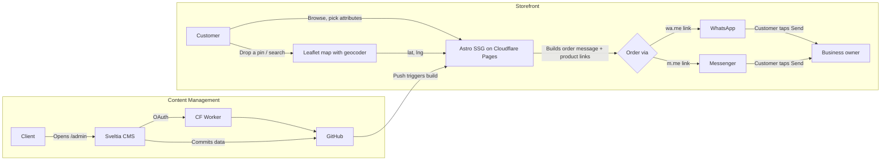

# Software Requirements Specification
## Metal Hub — Product Showcase & Ordering Site

| | |
|---|---|
| **Version** | 2.0 |
| **Date** | 2026-06-24 |
| **Stack** | Astro v7 + Tailwind CSS v4 + Cloudflare Pages + Sveltia CMS + Leaflet/OSM |
| **Author** | Chandan |

---

## 1. Overview

A static, mobile-first, trilingual storefront for Metal Hub (copper/brass/bronze kitchenware, Kathmandu) that:

- Showcases the product catalog with variant properties (size, material, finish), translatable attributes, per-option images, and discounts at both the product and individual attribute-option level
- Toggles between English, Nepali, and Newari/Nepal Bhasa — the third displayed in Ranjana script (रञ्जना लिपि)
- Lets customers pick a delivery drop point on a searchable map, then place the order as a pre-filled WhatsApp/Messenger message with product links — no payment gateway, no backend required for the order itself
- Gives the **client** (non-technical, no git/code knowledge) a simple web UI to add, edit, and remove products themselves with full i18n support
- Costs **$0/month** at current traffic levels and stays fast globally

## 2. Assumptions & Out of Scope (v1)

- **No embedded payment gateway, and the site never asks for a payment method.** That's left entirely to the WhatsApp/Messenger conversation the order kicks off — the business owner tells the customer where to pay (COD, bank QR, eSewa, whatever fits that order), same as how the business already operates.
- **Order record = the WhatsApp/Messenger thread itself.** No order dashboard in v1. The business owner replies directly to the customer in that thread to confirm, adjust, and arrange delivery.
- **No customer accounts/login.** Guest ordering only.
- **No live stock sync** — "in stock / out of stock" is a manual toggle the client sets, not deducted automatically per order.
- **Three languages, single currency (NPR).** English (default) and Nepali are straightforward — both are properly Unicode-encoded (Latin, Devanagari). Newari/Nepal Bhasa in Ranjana script is a different situation, flagged clearly because it changes the implementation: **Ranjana has no official Unicode encoding yet**. In practice, *every* real Ranjana website today works around this by storing the text as ordinary Devanagari and displaying it through a Devanagari-mapped Ranjana font — see §5.1 for exactly how this is implemented here. It's the standard, not a shortcut.
- **Map drop-point capture is a pin location, not a full address-autocomplete system** — kept deliberately simple and free; geocoder search by landmark name is available but reverse-geocoded place names are a nice-to-have, not a requirement.

## 3. Why this stack

| Requirement | Choice | Reasoning |
|---|---|---|
| Free + fast hosting | **Cloudflare Pages** | Unlimited bandwidth even on free tier, 500 builds/month, global edge network, no card required. |
| Static frontend | **Astro v7** | Ships zero JS by default; cart, map widget, and language toggle are the only interactive bits. SSG with dynamic `[...locale]` routes. |
| Styling | **Tailwind CSS v4** | CSS-first config via `@tailwindcss/vite`. No `tailwind.config.js` needed. ~50 lines of residual CSS. Mobile-first responsive design. |
| Client product management | **Sveltia CMS** | Git-backed headless CMS, <500KB, modern successor to Decap/Netlify CMS. Web form at `/admin`, no code/git needed, works on mobile, has first-class **i18n support** for translating specific fields per locale. |
| Auth for the CMS | **Cloudflare Worker (`sveltia-cms-auth`)** | One-click-deploy OAuth proxy, free, stays inside Cloudflare. |
| Trilingual routing | **Astro's built-in i18n** | `[...locale]` dynamic routes with `getStaticPaths()`. `en` (default, root), `ne` (`/ne/...`), `newa` (`/newa/...`). |
| Newari / Ranjana display | **Devanagari text + self-hosted "Ranjana Lipi" web font** | Store real Devanagari text, swap in a Ranjana-mapped font for that locale only. Falls back to plain Devanagari if font fails. |
| Map / drop point | **Leaflet.js + OpenStreetMap + geocoder** | Free, no API key. Geocoder search by landmark name. Pin's lat/lng becomes a Google Maps link in the order message. |
| Order delivery | **wa.me / m.me deep link, built client-side** | Zero backend. The customer's own WhatsApp/Messenger app sends the message; the business owner replies in the same thread to confirm. |
| Social media | **Official native widgets** | Facebook Page Plugin, TikTok profile embed, Instagram profile embed. All loaded lazily. |
| Linting | **Biome** | Formatter + linter, 4-space indent, double quotes, semicolons. Pre-commit hooks via husky + lint-staged. |
| Package manager | **Bun** | Fast installs, `bun.lock` for reproducibility. |

## 4. Architecture



No server in the ordering path at all — the "backend" is the customer's own messaging app.

## 5. Functional Requirements

### 5.1 Storefront & i18n (EN / NE / Newari)
- **FR-1.1** Home page: hero, featured products (configurable via `featured` field), category shortcuts
- **FR-1.2** Product listing, filterable by category and stock status, with "Load More" pagination (9 per page)
- **FR-1.3** Product detail page: image gallery with thumbnails, fullscreen lightbox, attribute selectors with live price recalculation, share button
- **FR-1.4** Language switcher dropdown in the header — SPA navigation, no page refresh
- **FR-1.5** All static UI text sourced from `en.json` / `ne.json` / `newa.json` dictionaries
- **FR-1.6** Product `name` and `description` are translatable per-product via the CMS (§8); price, images, attributes, and discount are shared across all three languages
- **FR-1.7** **Attribute names and option labels are translatable** — stored as `{en, ne, newa}` objects in both the schema and CMS
- **FR-1.8** **Newari content is typed in plain Devanagari** — the client types Nepal Bhasa wording normally, no Ranjana glyph input required
- **FR-1.9** When the Newari locale is active, the site loads a self-hosted Ranjana-mapped web font; falls back to Noto Sans Devanagari if font fails
- **FR-1.10** **Active nav highlighting** — current page highlighted in the navigation bar
- **FR-1.11** **URL parameter sync** — attribute selections are reflected in URL query params (e.g., `?Size=Large&Finish=Antique`), enabling shareable links
- **FR-1.12** URL params are read on page load to auto-select matching attributes — shared links show the correct configuration

### 5.2 Discounts
- **FR-2.1** A product may have a **product-level discount**: `active` toggle, `type` (`percentage` or `flat`), `value`
- **FR-2.2** Any **attribute option** may carry its own discount, independent of the product-level one
- **FR-2.3** Precedence: if any selected option has a discount, apply the single largest one; fall back to product-level; otherwise no discount
- **FR-2.4** Attribute selectors show a "Sale" indicator next to discounted options
- **FR-2.5** Product cards/detail pages show struck-through original price and discounted price
- **FR-2.6** The discounted price is what's carried into the cart and order message

### 5.3 Product Catalog & Variants
- **FR-3.1** Attribute groups (Size, Finish, etc.) with **translatable names and option labels** (`{en, ne, newa}` objects)
- **FR-3.2** Each attribute option can have **multiple images** (`images: string[]`) — gallery updates when option is selected
- **FR-3.3** **Per-option discounts** — independent discounts on each attribute option
- **FR-3.4** **English keys for consistency** — attribute names/labels stored as `{en, ne, newa}` but URL params and cart use English keys (e.g., `?Size=Large` not `?साइज=ठूलो`)

### 5.4 Product Page Features
- **FR-4.1** **Image gallery** with horizontal thumbnail strip, prev/next arrows, fullscreen lightbox with keyboard navigation (←→ arrows, Escape)
- **FR-4.2** **Per-option images** — selecting an attribute option with images swaps the gallery; selecting a different image from gallery works independently
- **FR-4.3** **Share button** — popup with product preview, WhatsApp/Facebook/Twitter share buttons, and copy-to-clipboard link
- **FR-4.4** **Social media embeds per product** — optional TikTok/Instagram/Facebook video embeds, lazy-loaded via IntersectionObserver
- **FR-4.5** **Product pagination** — "Load More" button on product listing (9 per page)

### 5.5 Map Drop-Point
- **FR-5.1** Checkout step embeds a Leaflet map centered on Kathmandu Valley
- **FR-5.2** Customer taps to place a pin; pin's `{lat, lng}` is captured
- **FR-5.3** **Geocoder search** — customers can search by landmark name (Nominatim, Nepal-only)
- **FR-5.4** Map is lazy-loaded via IntersectionObserver; CSS not loaded until needed
- **FR-5.5** A confirmation message is shown after pin placement

### 5.6 Cart & Ordering (no backend)
- **FR-6.1** Client-side cart (`localStorage`): add/remove items, adjust quantity (quantity selector on product page), see running total
- **FR-6.2** Cart shows **product thumbnails** and **clickable product names** with attribute params in URLs
- **FR-6.3** Checkout form: name (required), phone (required, 10-digit pattern), map pin, optional note — **order buttons disabled until all required fields are filled**
- **FR-6.4** "Order via WhatsApp" and "Order via Messenger" buttons build a formatted message with **product links** for each item:
  ```
  New Order — Metal Hub

  Customer: Sita Sharma
  Phone: 98XXXXXXXX

  Items:
  1. Brass Chiba (Size: Large, Finish: Antique) x1 — NPR 2,500
     https://metalhub.com/products/brass-chiba/?Size=Large&Finish=Antique
  2. Copper Tumbler (Size: Medium) x2 — NPR 1,200
     https://metalhub.com/products/copper-tumbler/?Size=Medium

  Subtotal: NPR 3,700

  Delivery location: https://www.google.com/maps?q=27.7172,85.3240

  Please confirm availability, delivery time, and how you'd like me to pay. Thank you!
  ```
- **FR-6.5** Customer taps Send — message lands directly in the business's inbox
- **FR-6.6** Business owner replies in that thread to confirm — no separate dashboard needed

### 5.7 Social Media Page
- **FR-7.1** Page at `/social` with three sections — Facebook, Instagram, TikTok — each with a "Follow ↗" link
- **FR-7.2** **Facebook** embeds the official Page Plugin (auto-updating feed)
- **FR-7.3** **TikTok** — profile creator embed with `data-unique-id`, `data-embed-from`, `data-embed-type`
- **FR-7.4** **Instagram** — profile embed via `instagram-media` blockquote
- **FR-7.5** Social embeds re-initialize on SPA navigation (via `astro:page-load` event)
- **FR-7.6** Responsive layout — embeds stack vertically on mobile, center on desktop

### 5.8 Product Management (Client-facing)
- **FR-8.1** `/admin` loads Sveltia CMS, GitHub OAuth login via the Worker
- **FR-8.2** Client can create/edit/delete products: translatable name & description, category, images, base price, in-stock toggle, **translatable attribute groups with per-option images and discounts**, **per-product social media embeds**
- **FR-8.3** Saving = git commit → Cloudflare Pages auto-rebuild (~1–2 min) → live
- **FR-8.4** Works on mobile browser

## 6. Non-Functional Requirements

| Category | Requirement |
|---|---|
| Performance | Tailwind CSS v4 (fastest build); map widget lazy-loaded; social embeds lazy-loaded |
| Cost | $0/month at current/expected traffic |
| Availability | Cloudflare's global edge network |
| Mobile | Mobile-first responsive layout; map and WhatsApp button work on phone screens |
| SEO | Open Graph tags per product page for clean previews when shared |
| Security | CMS auth via OAuth; no order data touches any server |
| Code Quality | Biome linting + formatting; pre-commit hooks via husky + lint-staged |

## 7. Data Model

**Product** (managed via Sveltia CMS, one file per product)
```yaml
slug: brass-chiba-large
name: { en: "Brass Chiba", ne: "ब्रास चिया", newa: "<genuine Nepal Bhasa wording>" }
description: { en: "Traditional brass chiba, hand-finished.", ne: "...", newa: "..." }
images:
  - /images/products/chiba-1.jpg
category: brass
basePrice: 1800
inStock: true
featured: false
discount:
  active: true
  type: percentage
  value: 10
attributes:
  - name: { en: "Size", ne: "साइज", newa: "साइज" }
    options:
      - label: { en: "Small", ne: "सानो", newa: "सानो" }
        priceModifier: 0
        discount: { active: true, type: percentage, value: 15 }
        images:
          - /images/products/chiba-small.jpg
      - label: { en: "Large", ne: "ठूलो", newa: "ठूलो" }
        priceModifier: 700
socialEmbeds:
  - platform: tiktok
    embedCode: '<blockquote class="tiktok-embed" ...>...</blockquote>'
  - platform: instagram
    embedCode: '<blockquote class="instagram-media" ...>...</blockquote>'
```

**Cart Item** (assembled client-side in localStorage)
```json
{
  "slug": "brass-chiba-large",
  "name": "Brass Chiba",
  "images": ["/images/products/chiba-large.jpg"],
  "selectedOptions": { "Size": "Large", "Finish": "Antique" },
  "selectedModifiers": [700, 150],
  "unitPrice": 2500,
  "originalUnitPrice": 2780,
  "hasDiscount": true,
  "qty": 1
}
```

**Order Message** (built client-side, sent via WhatsApp/Messenger)
```
New Order — Metal Hub

Customer: Sita Sharma
Phone: 98XXXXXXXX

Items:
1. Brass Chiba (Size: Large, Finish: Antique) x1 — NPR 2,500
   https://metalhub.com/products/brass-chiba/?Size=Large&Finish=Antique

Subtotal: NPR 2,500

Delivery location: https://www.google.com/maps?q=27.7172,85.3240

Please confirm availability, delivery time, and how you'd like me to pay. Thank you!
```

## 8. Sveltia CMS Config

See `public/admin/config.yml` for the full configuration. Key collections:

| Collection | i18n | Fields |
|---|---|---|
| `products` | yes | name, slug, description, category, images, basePrice, inStock, featured, discount, **translatable attributes** (name + labels), **per-option images**, **social embeds** |
| `categories` | yes | name, slug, icon, order |
| `settings` | no | whatsappNumber, messengerPage |
| `i18n` | no | key, en, ne, newa |

**Translatable attributes** use `i18n: true` on the attribute name and option label fields in the CMS config, creating three language tabs for each.

## 9. Tech Stack Details

| Tool | Version | Purpose |
|---|---|---|
| Astro | 7.x | SSG framework |
| Tailwind CSS | 4.x | Styling (CSS-first via `@tailwindcss/vite`) |
| Biome | 2.x | Linting + formatting |
| Bun | 1.x | Package manager |
| Leaflet | 1.9.4 | Map with geocoder |
| Sveltia CMS | latest | Content management |
| Husky | 9.x | Pre-commit hooks |
| lint-staged | 17.x | Staged file linting |

## 10. Build Phases

| Phase | Scope |
|---|---|
| **Phase 1** | ✅ Astro site + Sveltia CMS live: catalog, discounts, translatable attributes, EN/NE/Newari toggle |
| **Phase 2** | ✅ Cart, Leaflet map with search, WhatsApp/Messenger order builder with product links, share button, product gallery/lightbox |
| **Phase 3 (optional)** | Parallel order logging (Pages Function → n8n → Sheet/Postgres), order status dashboard, eSewa/Khalti gateway, stock auto-decrement |

## 11. Free-Tier Cost Check

| Service | Free limit | Expected usage | Verdict |
|---|---|---|---|
| Cloudflare Pages | Unlimited bandwidth, 500 builds/mo | A few builds/week from client edits | Comfortable |
| Cloudflare Worker (CMS auth) | 100,000 requests/day | A handful of CMS logins/day | Comfortable |
| GitHub | Free private repo | Single repo, single collaborator | Comfortable |
| Leaflet.js | Open source, MIT | Client-side only | No cost, no key |
| Ranjana web font | Free download (license to verify) | One-time, self-hosted | No cost; confirm redistribution terms |
| OpenStreetMap tiles | Free, fair-use | Low traffic site | Comfortable |
| wa.me / m.me | Free | Per order | No cost |

## 12. Future Enhancements (not in v1)
- eSewa/Khalti checkout (requires merchant API keys + a real backend payment flow)
- Parallel order logging to a Sheet/Postgres for record-keeping beyond chat history
- Order status admin panel
- Auto stock decrement per confirmed order
